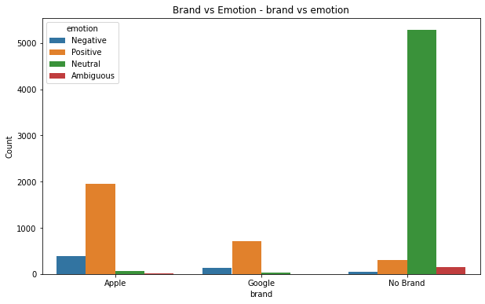
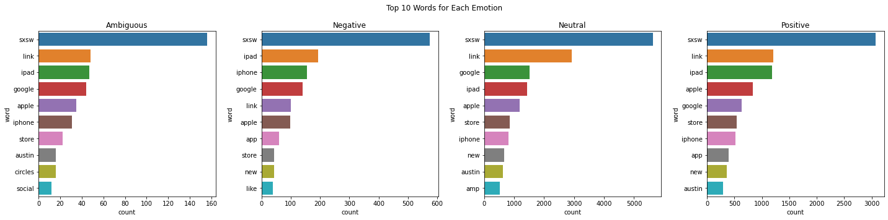

# Twitter Sentiment Analysis Project

This project utilizes sentiment analysis of Twitter data to understand customer views and preferences regarding iPhone and Google products. By examining user sentiments, Best Buy intends to make stocking decisions that match customer demand and boost overall satisfaction.

## Overview

Best Buy, a leading retailer of iPhone and Google products, aims to improve its inventory choices by analyzing user opinions on these items. This project utilizes sentiment analysis of Twitter data to understand customer views and preferences regarding iPhone and Google products. By examining user sentiments, Best Buy intends to make stocking decisions that match customer demand and boost overall satisfaction. The project involves gathering Twitter data on discussions, reviews, and mentions of iPhone and Google products, followed by data preprocessing and sentiment analysis. The insights gained will help Best Buy optimize its product selection and align it with customer preferences.

## Problem statement

Best Buy, a top reseller of iPhone and Google products, encounters difficulties in aligning its inventory with customer preferences. The lack of a structured approach to analyzing user sentiments on Twitter hinders data-driven stocking decisions. This project aims to utilize Twitter sentiment analysis to better understand customer opinions. By gaining insights into user sentiments, Best Buy aims to enhance its stocking decisions, ensuring product availability that matches customer preferences and improves overall customer satisfaction and loyalty.

## Business Value

By leveraging Twitter sentiment analysis to understand customer opinions, Best Buy will be able to make more informed stocking decisions leading to better allocation of resources, improved product assortment, enhanced customer satisfaction and profitability. By staying ahead of trends and understanding customer sentiments better than competitors, Best Buy can position itself as a preferred destination for purchasing iPhone and Google products.

## Objectives

The goal of this project is to analyse customer sentiments on Twitter to inform Best Buy's stocking decisions for iPhone and Google products. By analyzing customer opinions, the aim is to improve resource allocation, optimize product assortment, enhance customer satisfaction, and ultimately increase profitability.

## Research Questions

1. What are the predominant sentiments expressed by customers on Twitter regarding iPhone and Google products?

2. What factors influence the polarity of tweets related to iPhone and Google products on Twitter?

3. Which specific features of iPhone and Google products are most frequently praised or criticized by users on Twitter?

4. Which machine learning model is most effective in sentiment analysis?

## Data Understanding

The Present dataset contains a series of 9093 Tweets, the dataset has been pre-labeled by human raters. Raters judged if the tweet's text expressed a positive, negative or no emotion towards a brand and/or product, any time an emotion was expressed the rater was then asked to identify the brand or product that was the target of that emotion. All of this data was compiled into a CSV file labeled "judge-1377884607_tweet_product_company.csv" that can be found in the root of this repository.

The Tweets were in large part centered on Apple and Google products during/after the 2011 South by Southwest (SXSW) Conference. The resulting data file contains three columns per row, one for the tweet's text, one for the emotion expressed and one for the target product/brand of that emotion, when identifiable.

Data was sourced from CrowdFlower via data.world, added by Kent Cavender-Bares on August 30, 2013.

## Data Analysis
### Univariate Analysis
In this part, we analyzed distribution of brands and emotions in tweets,tweet length distribution, brand value counts and emotional counts. Basically, this part involves analyzing each variable independently.
- We first analyzed the brand distribution graph whereby the "No Brand" category has the highest count, close to 6000. This indicates that a significant portion of the dataset consists of unbranded products. The "Apple" brand has the second-highest count, slightly above 2000. This suggests a strong presence and popularity of Apple products within the dataset. The "Google" brand has the lowest count, slightly above 1000. While it has a notable presence, it is less prevalent compared to Apple and the "No Brand" category.

- Then we analyzed emotion distribution whereby it was found that the majority of the data is categorized as `"Neutral,"` followed by `"Positive"` emotions. There is a significantly lower count of `"Negative"` and `"Ambiguous"` emotions. Most tweets exhibit neutral sentiment, indicating that the dataset may have a majority of tweets with objective or balanced tones.

- We also analyzed tweet lengths where it was observed that the distribution of tweet lengths is approximately normal, with the majority of tweets falling between 60 and 100 characters.

### Bivariate Analysis
In this part, we wrote a function `myf.run_bivariate_analysis(df)` which performs a bivariate analysis on the dataframe df. This typically involves examining the relationships between two variables at a time.
- The first bivariate analysis that we did was analyzing brand vs emotion. The distribution of emotions across brands provides insights into how people feel about them. For Apple and Google, Positive emotions are predominant, indicating favorable sentiment. The high count of Neutral emotions for the No Brand category might suggest ambivalence or non-specific sentiment.

- The other bivariate analysis that we did was Tweet length vs emotion. The distribution of tweet lengths was across four different emotion categories: Negative, Positive, Neutral, and Ambiguous. Each box plot displays the range of tweet lengths, including the median, quartiles, and any potential outliers. The median tweet length is similar across all four emotion categories, indicating that the central tendency of tweet lengths does not vary significantly with the emotional content.

## Preprocessing
This section outlines our preprocessing to prepare for modeling. We located frequent words to remove that are irelevant to the sentiment of the tweet (consider @mention, rt, link, sxsw).

The preprocessing part takes in a document or tweet and does the following:
- Creates word tokens
- Stems and Lemmatizes
- Removes stopwords
- Gets the parts of speech for the lemmatizer
- The preprocessing step returns the cleaned joined tweet.
We visulaized the top 10 words for eac emotion and it was noted that word frequencies in the Neutral category were significantly higher than in other categories, suggesting that the dataset is skewed toward neutral or factual sentiment rather than strong opinions.
Also the prominence of terms like "sxsw," "apple," "google," and "iphone" across categories indicates that the dataset is heavily focused on technology-related discussions, possibly centered around an event (likely SXSW).

## Modelling
All models involved removing a common list of stop words (as well as a list of stop words that we supplemented), tokenizing and lemmatizing the tweet text feature.
The central aspect of this project revolves around training and evaluating different machine-learning models for sentiment analysis. These models included Naive Bayes, Neural Networks, Random Forest, and XGBoost, among others. To address class imbalance within the dataset, we applied oversampling techniques. These strategies effectively enhanced the models' performance and their ability to accurately classify tweets.

## Model Comparison
- The `Neural Networks (Fine-Tuned)` model had the highest test accuracy and precision, showing that fine-tuning significantly improves its performance.
- `Naive Bayes` and `Random Forest` (Default and Fine-Tuned) models show reasonable performance but lag behind the neural network models.
- `XGBoost` shows a slight improvement after fine-tuning but still underperforms compared to the Neural Networks.
Each model has its strengths, but based on the metrics provided, the fine-tuned Neural Networks model appears to be the best performer in terms of test accuracy and precision.

## Conclusions

1. The sentiment analysis revealed distinct trends in customer opinions about iPhone and Google products. Positive sentiments dominated, reflecting strong customer satisfaction, while negative sentiments provided valuable insights into areas of improvement.
2. Among the models tested, the Fine-Tuned Neural Networks model performed the best with an accuracy of 90%. This demonstrates its suitability for text classification tasks like sentiment analysis.
3. Frequent mentions of specific features, such as "store," "link," and "ipad," highlighted customer priorities and areas of focus for both brands. These terms provided actionable insights into customer needs and preferences.
4. Tweets were effectively categorized into ambiguous, negative, neutral, and positive emotions. This categorization provided a nuanced understanding of customer sentiment, enabling more targeted decision-making.

## Recommendations

1. Regularly monitor and analyze customer feedback on social media platforms to stay updated on changing preferences and emerging trends.
2. Investigate and address the root causes of negative sentiments. For instance, frequent mentions of "store" in a negative context could indicate issues with in-store experiences or product availability.
3. Pay attention to commonly mentioned product features and ensure they align with customer expectations. For example, improving features like "Ipad" or "link" based on customer discussions can boost satisfaction.
4. Adopt and integrate sentiment analysis tools into business processes to automate and scale this analysis for other products and brands.
5. Utilize the best-performing model (Neural Networks (Fine-Tuned) for ongoing sentiment analysis tasks. Regularly retrain the model with new data to maintain its accuracy and relevance.
6. Expand the sentiment analysis framework to include competitors and other product categories. This can provide a comprehensive view of market dynamics and inform strategic decisions.

### Links
- [Link to Notebook](NLP-project.ipynb)
- [Link to Presentation](Project%20Presentation.pdf)
